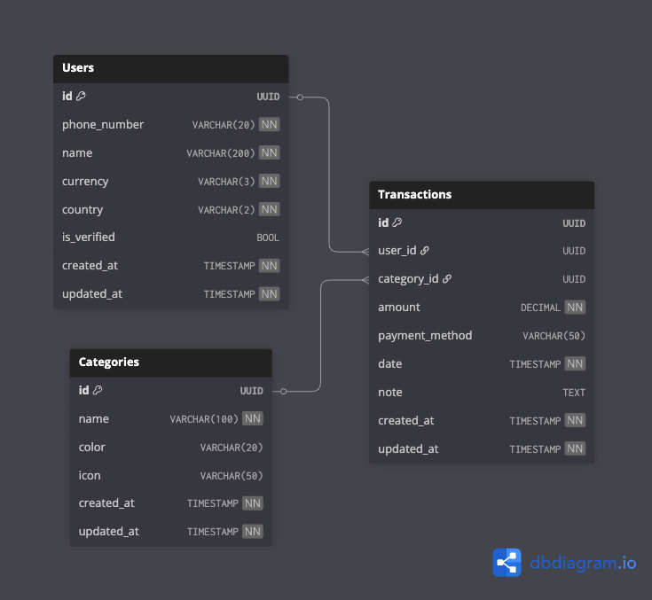

# CashTrack - V1

## 1. What is CashTrack?
CashTrack is a personal finance tracking application designed to help users gain better control over their money.  
It enables users to record transactions, categorize spending, and analyze financial habits with ease.  
The backend provides secure APIs for managing authentication, transactions, categories, and financial reporting.  

### Key Features:
- Record and track **expenses, transfers, and budgets**
- Categorize spending with customizable categories
- Generate **reports, summaries, and analytics** over time
- Manage **users, accounts, and authentication** securely
- Provide data to a mobile app for visualizing **cash flow, balances, and charts**

## 2. Architecture
- **Language:** Go (Golang)
- **Framework:** Gin (for REST APIs)
- **Database:** PostgreSQL
- **Architecture Style:** Hexagonal Architecture (Ports & Adapters)
    - Core business logic (domain) is decoupled from external systems like the database, HTTP, or messaging.
    - Allows swapping or modifying adapters without impacting the core logic.
- **Other:** Follows 12-Factor App principles for scalability and maintainability.

## 3. Database Schema
The database schema for CashTrack V1 provides a structured overview of all entities, relationships, and constraints used in the backend. It is designed to efficiently track users, accounts, transactions, categories, and budgets.

You can also explore an interactive version of the schema on dbdiagram: [View Database Diagram](https://dbdiagram.io/d/Cashtrack-v1-68c167bb61a46d388e658af5)

## 4. 12-Factor App Compliance

- Codebase: Single codebase tracked in Git
- Dependencies: Managed with Go modules
- Config: Stored in environment variables (.env)
- Backing Services: PostgreSQL as database
- Build, Release, Run: Separated stages
- Processes: Stateless, share-nothing processes
- Port Binding: Exposes services via HTTP
- Concurrency: Scales via process model
- Disposability: Fast startup and graceful shutdown
- Dev/Prod Parity: Consistent environments
- Logs: Standard output logging
- Admin Processes: Managed separately via CLI tools